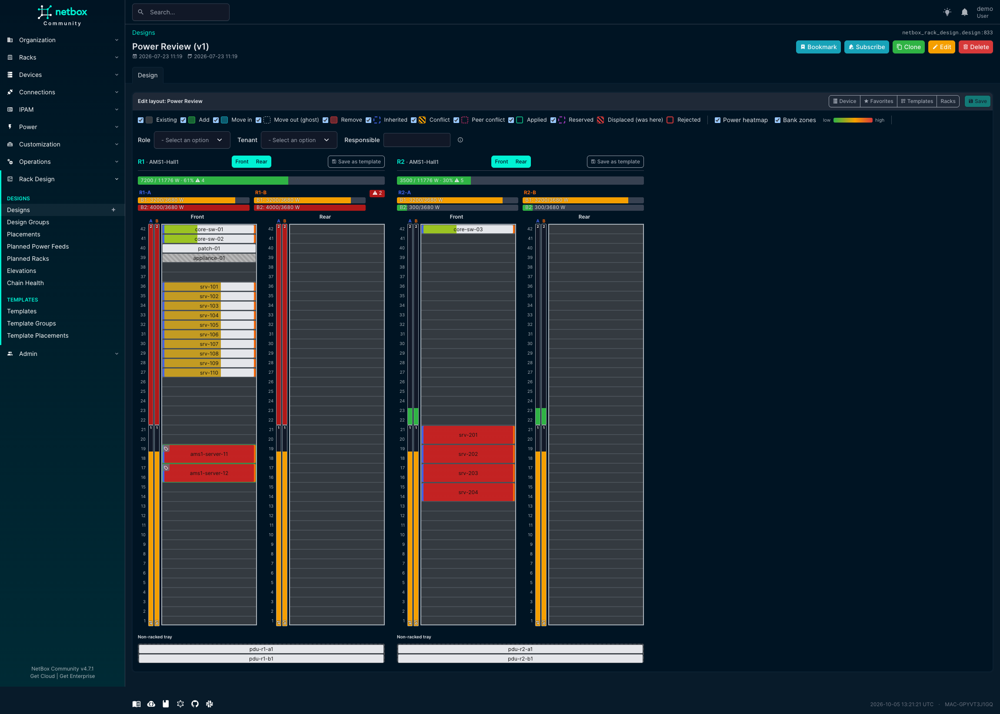
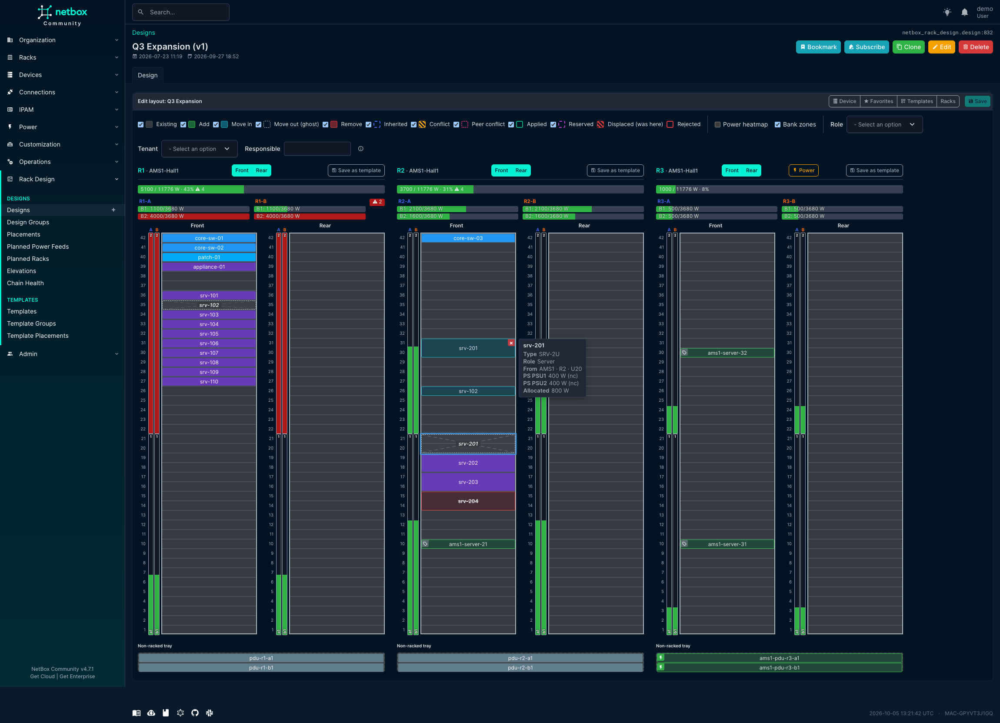
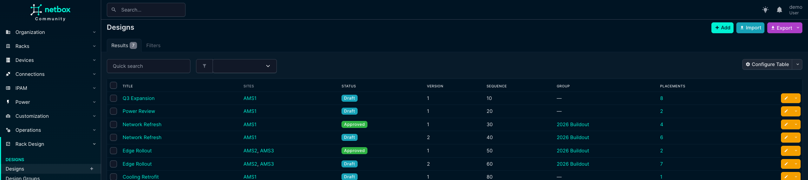
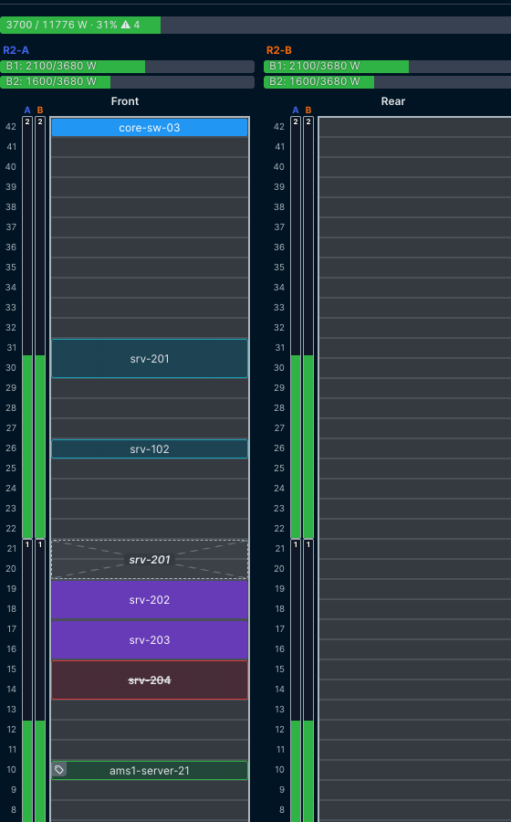
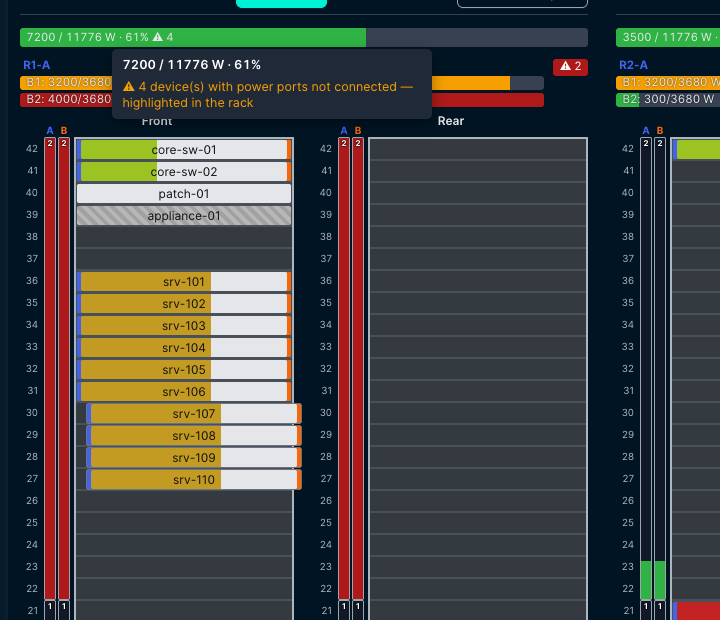
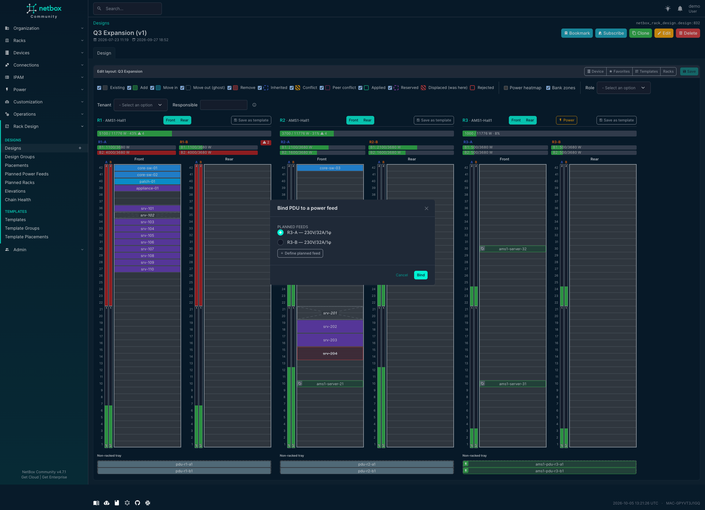

<p align="center">
  
</p>

# NetBox Rack Design

**Plan rack changes as versioned designs — on top of your real NetBox data, without touching it until you're ready.**

<p align="center">
  <a href="https://www.youtube.com/watch?v=2N1hwF_oUYc"><b>▶ Watch the 2-minute quick tour</b></a>
  &nbsp;·&nbsp;
  <a href="https://www.youtube.com/playlist?list=PLQrzYAZqdcXg"><b>▶ Full 10-part tutorial</b></a>
</p>

NetBox Rack Design adds a lightweight *design layer* to NetBox for planning device adds, moves, and removals in your racks. A **Design** is a named, versioned proposal that overlays your live DCIM data: your real `dcim.Device` and `dcim.Rack` records stay untouched, and each planned change — add, move, or remove — is captured as a structured **placement** instead of a spreadsheet cell. This brings the *intended* rack layout into NetBox and renders it as a projected rack elevation, with power projection, an auto-naming engine, design chains (baselining one design on another approved one), and an explicit Apply step already built in.

The plugin is fully generic and public — nothing organization-specific is hardcoded. Status names and behavior are driven entirely by `PLUGINS_CONFIG`, and only native NetBox mechanisms are used (change logging, tags, custom fields, permissions, REST + GraphQL APIs, global search).

## Features

Rack Design pairs a structured data model with an interactive visual editor for composing rack plans. Applying a design into NetBox, conflict detection within a design chain, and conflict detection between two unrelated designs planning the same rack are all delivered (see [Roadmap](#roadmap)).

- **Three models** for capturing rack plans:
  - **Design** — a proposed set of rack changes for one or more sites, scoped to one or more racks. Versioned (clone-and-tweak, with one approved version per plan), ordered for execution via an auto-assigned `sequence`, may declare explicit `depends_on` relationships, may optionally belong to a group, and may be **`based_on`** exactly one other approved design — forming a design chain (see [docs/design-chains.md](docs/design-chains.md)). Carries `title`, `status`, `summary`, generic external `link`, plus description/comments/tags/custom fields.
  - **DesignGroup** — an optional, hierarchical container that links related designs into a larger effort (multi-stage work or cross-site coordination). Purely organizational; never affects execution order.
  - **DesignPlacement** — a single proposed change within a design: **add** a new device from the device-type catalog (with an intended role and tenant), **move** an existing device, or **remove** (planned) one. Target slots are validated against NetBox's own `Rack.get_available_units()` collision logic. Real devices are never mutated.
- **Interactive multi-rack visual editor** — a GridStack drag-and-drop editor that renders all of a design's racks side by side, across both front and rear faces, for composing adds/moves/removes. Includes a searchable **device-type catalog palette**, **per-user favorite device types in named sets**, **per-user rack visibility**, a live-filtering legend, and a hover card with per-PSU power detail. Every edit writes placements only — live devices are never touched. See [docs/editor.md](docs/editor.md).
- **Chassis & blades** — a device with bays (a blade chassis, a patch-panel frame) is edited on a **chassis layer**: every chassis in scope as a column of bays, driven by the same editor, with the palette filtered to child types. Works for a real chassis and for one the design itself adds; blade power is never double-counted; a read-only chassis elevation mirrors it. See [docs/editor.md](docs/editor.md#chassis--blades).
- **Planned racks** — plan into a rack that does not exist in NetBox yet: **Create rack** in the editor (name, height, location) and it behaves like any other rack — devices, naming, power, conflict detection. Shared between designs like a real rack; on Apply a matching real rack is **adopted**, otherwise one is created. See [docs/planned-racks.md](docs/planned-racks.md).
- **Templates** — a reusable rack layout with no site ("our standard ToR"), stamped into any design by dragging a card onto a rack, or applied to several racks / a **template group** mapped rack-by-rack from one dialog. Stores device type, role, tenant, planning fields and an anchor — never a position, a name or power. Extract one from a rack in a design (**Save as template**) or from any real rack. See [docs/templates.md](docs/templates.md).
- **Planning fields** — declare your own per-deployment attributes (`placement_fields`) and they appear on the editor toolbar rail and in each tile's **Planning attributes** dialog, on the hover card, in the API, and are written to the planned device on Apply. A move can re-attribute the device it relocates. See [docs/planning-fields.md](docs/planning-fields.md).
- **Projected rack elevations** — a read-only elevation view showing how a design's racks *would* look once applied (all racks, both faces, full-depth devices rendered across both faces), plus a filterable elevations list.
- **Rack-page integration** — an optional panel on the core `dcim.rack` detail page listing the designs that touch that rack, each linking to its editor and elevation.
- **Read-only surfaces** — an **Elevations** browser across every design, a **Chain Health** report of designs whose chain is refused or that carry stale placements, and first-class list/detail views for placements, planned power feeds, planned racks, templates and template groups.
- **Config-driven statuses** — which device statuses count as "planned" and which mark a planned removal are read from `PLUGINS_CONFIG`, never hardcoded.
- **Naming convention engine** — auto-names planned devices via `naming_mode` = `sequence` / `template` / `script` (a dotted-path callable), with graceful fallback when a template or script fails; a move gets a rename suggestion from the same engine. See [docs/device-naming.md](docs/device-naming.md).
- **Power projection & PDU distribution** — a read-only power overlay: a per-rack capacity-vs-projected-consumption bar plus a per-device power heatmap, and per-PDU/per-bank power distribution (`distribution_mode` = `none` / `builtin` / `script`) with planned-PDU feed binding, planned power feeds for greenfield racks, **Copy from rack**, a **Bank zones** strip showing which units each bank serves, and a per-device feed-leg choice. See [docs/power-projection-spec.md](docs/power-projection-spec.md), [docs/power-distribution.md](docs/power-distribution.md), and [docs/pdu-distribution-spec.md](docs/pdu-distribution-spec.md).
- **Apply a design** — materialize an approved design in NetBox as *planned* devices: each target slot is
  reserved so nobody else can take it, planned cabling has real ports to attach to, and removals are flagged
  with a configured status. Safe to press twice (it reconciles rather than duplicating), all-or-nothing in one
  transaction, ordered along a chain, and run entirely with your own DCIM permissions. Available as a button and
  as an API action with a read-only dry run. See [docs/apply.md](docs/apply.md).
- **Design chains** — baseline a design on another **approved** design (`based_on`), so one team's moves/removes/adds render as the starting world for the next team's plan, across placements, naming and power. Approval freezes a design so its children can trust it; an ancestor that regresses to draft or moves to `implemented` makes the chain refuse (with a clear re-base prompt) rather than render a guess. See [docs/design-chains.md](docs/design-chains.md).
- Full **CRUD UI** with list/detail/edit/bulk views and a navigation menu.
- **REST API** at `/api/plugins/rack-design/` — every model plus actions (`save-layout`, `recompute-distribution`, `derive`, `new-version`, `rebase`, `apply` with a `GET` dry run) and a read-only `design-applies/` record of what each apply created.
- **GraphQL API** integration.
- **Global search** integration.
- **Change logging**, **tags**, and **custom fields** on the models.
- Integration with NetBox's native **permission** system.

## Screenshots

▶ **[Watch the 2-minute quick tour](https://www.youtube.com/watch?v=2N1hwF_oUYc)** — the editor, moves, and the power heatmap in action.

▶ **[Full 10-part tutorial playlist](https://www.youtube.com/playlist?list=PLQrzYAZqdcXg)** — the data model, the editor, the naming engine, power projection and rebalancing, greenfield planned power, per-bank distribution, and the REST/GraphQL/search integrations, one part per topic.

**Power heatmap with per-PDU / per-bank distribution** — each bank shows load vs.
breaker, overloads in red, feeds color-coded per leg.

[](https://www.youtube.com/watch?v=2N1hwF_oUYc)

**Multi-rack visual editor** — plan adds, moves, and removals across a design's
racks side by side, on top of your live data.


**Device hover card** — hover any tile to see its identity, type, role, and power
draw; a move-out ghost keeps its provenance (`was: …`) so you always know what
vacated a slot.



| | |
|---|---|
|  |  |
| _Designs list — versioned plans, scoped to one or more racks._ | _Placement states: planned add, move-in, move-out ghost, and flagged removal._ |
|  |  |
| _Hover the ⚠ to see which powered devices aren't cabled yet._ | _Bind a planned PDU to a real or planned power feed._ |

More in the [documentation](https://ravenrs.github.io/netbox-rack-design/).

## Compatibility

| Plugin Version | Minimum NetBox Version | Maximum NetBox Version | Python    |
|----------------|------------------------|------------------------|-----------|
| 0.17.x         | 4.4.0                  | 4.6.99                 | 3.12+     |
| 0.16.0         | 4.4.0                  | 4.6.99                 | 3.12+     |
| 0.15.x         | 4.4.0                  | 4.4.99                 | 3.12+     |

The supported NetBox range is enforced at load time via the plugin's `min_version` / `max_version`. See [COMPATIBILITY.md](https://github.com/ravenrs/netbox-rack-design/blob/main/COMPATIBILITY.md) for the full per-version matrix.

## Dependencies

- **NetBox** 4.4.0 – 4.6.99 (tested against 4.4.8, 4.5.10 and 4.6.8)
- **Python** 3.12 or later

No additional Python packages are required beyond NetBox's own dependencies.

## Installation

Install from PyPI into the same environment as your NetBox installation:

```bash
pip install netbox-rack-design
```

For NetBox Docker, add `netbox-rack-design` to your `plugin_requirements.txt`. See the
[netbox-docker plugin instructions](https://github.com/netbox-community/netbox-docker/wiki/Using-Netbox-Plugins).

Enable the plugin in your NetBox configuration (`configuration.py`, or `plugins.py` for netbox-docker):

```python
PLUGINS = [
    "netbox_rack_design",
]

# Optional — defaults shown. Only include keys you want to override.
PLUGINS_CONFIG = {
    "netbox_rack_design": {
        "planned_status": "planned",
        "removal_status": "decommissioning",
        "default_status": "draft",
        "enable_rack_panel": True,
    },
}
```

> **Note on `removal_status`.** The default `decommissioning` is the only native
> removal-oriented device status on a vanilla install. If `decommissioning` is
> *destructive* in your environment (e.g. it auto-deletes devices or triggers an
> external dismantle workflow), do **not** use it for planned removals. Instead add a
> safe custom status via NetBox's `FIELD_CHOICES` (for `dcim.Device.status`, e.g.
> `to_decommission`) and point `removal_status` at it.

Apply migrations, collect the plugin's static files, and restart NetBox:

```bash
python manage.py migrate
python manage.py collectstatic --no-input
# then restart your NetBox services (e.g. systemctl restart netbox netbox-rq)
```

## Upgrading

```bash
pip install --upgrade netbox-rack-design
python manage.py migrate
python manage.py collectstatic --no-input
# then restart your NetBox services (e.g. systemctl restart netbox netbox-rq)
```

Run `migrate` **before** using the plugin again: most releases add or change
model fields, and NetBox will raise a database error on any view that reads a
column the upgrade introduced.

Do not skip `collectstatic`. The rack editor is a JavaScript application served
from the plugin's own static files, so an upgrade that ships new assets leaves
the previous ones in place until they are collected — the editor then loads
against stale CSS and JS, which shows up as broken layout or drags that do
nothing rather than as an error.

Two things to check before upgrading:

- **[COMPATIBILITY.md](https://github.com/ravenrs/netbox-rack-design/blob/main/COMPATIBILITY.md)** — the
  NetBox version range each plugin release supports. Upgrading the plugin does
  not upgrade NetBox, and a plugin whose declared range excludes your NetBox
  will refuse to load.
- **[CHANGELOG.md](https://github.com/ravenrs/netbox-rack-design/blob/main/CHANGELOG.md)** — behaviour
  changes are listed per release under `### Changed`, and anything that needs
  action on your side is called out under a bold **Breaking Changes** heading.

Designs, placements and power rows are ordinary NetBox objects, so a downgrade
is only safe back to the release whose migrations your database still matches;
`python manage.py migrate netbox_rack_design <number>` unapplies to a specific
migration if you need to step back.

## Configuration

All settings are optional and configured under the `netbox_rack_design` key in `PLUGINS_CONFIG`.

| Key                 | Default              | Description                                                                                                  |
|---------------------|----------------------|--------------------------------------------------------------------------------------------------------------|
| `planned_status`    | `"planned"`          | The device status the plugin treats as "planned".                                                             |
| `removal_status`    | `"decommissioning"`  | The device status that marks a planned removal. Override with a safe custom status where `decommissioning` is destructive (see note above). |
| `default_status`    | `"draft"`            | Default lifecycle status for a new Design.                                                                    |
| `enable_rack_panel` | `True`               | Show the rack-page panel listing designs that touch a rack.                                                  |
| `naming_mode`       | `"sequence"`         | How a placement's proposed name is computed: `"sequence"` (`<design title>-<n>`), `"template"` (a `str.format` template over real model objects), or `"script"` (a dotted path to `fn(placement) -> str`). See [docs/device-naming.md](docs/device-naming.md). |
| `naming_template`   | `"{design.name}-{n}"`| Template used when `naming_mode == "template"`. Dotted attribute paths on the real Design/Device objects; `{design.name}` aliases the design title. |
| `naming_script`     | `""`                 | Dotted path to a callable used when `naming_mode == "script"`.                                                |
| `naming`            | `{}`                 | Reserved for future per-design naming options. No options are currently defined. |
| `distribution_mode` | `"none"`             | How per-PDU/bank load is distributed for the power heatmap: `"none"` (per-rack total only, per-device gradient), `"builtin"` (native distribution from bank = outlet port name segment + feed-leg = bound feed, zero config), or `"script"` (a dotted path to `fn(rack, devices) -> Distribution` dict). See [docs/pdu-distribution-spec.md](docs/pdu-distribution-spec.md). |
| `distribution_script` | `""`               | Dotted path to a callable used when `distribution_mode == "script"`.                                          |
| `planning_fields`   | `{}`                 | Custom-field bridge mapping site custom fields into the rack/PDU planning dialogs (read side, `source`), reachable by a `distribution_script`. Empty by default; native fields (voltage/amperage/phase/supply, feed binding) are never listed here. See [docs/planning-fields.md](docs/planning-fields.md#the-read-side-counterpart). |
| `placement_fields`  | `[]`                 | Your own per-device planning attributes (write side, `target`): shown on the editor rail / Planning attributes dialog / hover card / API, written to the planned device on Apply. See [docs/planning-fields.md](docs/planning-fields.md). |
| `power_capacity_default_w` | `1000`        | Fallback rack power capacity (watts) used when no `dcim.PowerFeed` is modeled on the rack. Not present in `default_settings`; read via `get_plugin_config` with this default. |
| `power_draw_basis`  | `"allocated"`        | Which PowerPort/PowerPortTemplate field to sum for projected draw: `"allocated"` or `"maximum"` (falls back to the other when the chosen one is unset). Not present in `default_settings`; read via `get_plugin_config` with this default. |
| `power_warn_pct`    | `80`                 | Utilization percentage at/above which a rack's power state is "warn". Not present in `default_settings`; read via `get_plugin_config` with this default. |
| `power_critical_pct`| `100`                | Utilization percentage at/above which a rack's power state is "critical". Not present in `default_settings`; read via `get_plugin_config` with this default. |
| `power_exclude_roles` | `("pdu", "unmanageable-pdu")` | Device role slugs (case-insensitive) excluded from the power-consumption sum — power infrastructure, not consumers. Not present in `default_settings`; read via `get_plugin_config` with this default. |
| `peer_conflicts_enabled` | `True` | Whether a design's projection reports conflicts with designs outside its own chain (peer designs planning the same unit, name, or device). A peer design's title is disclosed in these reports even past NetBox object permissions, since a conflict without a name to act on is not actionable; set to `False` to disable peer detection entirely if that disclosure is unacceptable. See [docs/peer-conflicts.md](docs/peer-conflicts.md). |

The `power_*` keys are not listed in the plugin's `default_settings` (they have no admin-facing default in `__init__.py`); they are still fully overridable via `PLUGINS_CONFIG`, resolved at read time by `netbox_rack_design/projection.py` with the defaults shown above.

**Note on object-permission constraints:** designs are now scoped by multiple sites. If you use NetBox's object-permission system to constrain designs by site (e.g., `{"site__slug": "…"}`), update your constraints to use `{"sites__slug": "…"}` to match designs in any of their sites.

## Roadmap

**Delivered**

- **Projected rack elevations (read-only)** — see how a design's racks *would* look once applied, with front/rear faces and full-depth devices rendered across both faces.
- **Interactive visual rack editor** — GridStack drag-and-drop adds/moves/removes across a **multi-rack workspace** and both rack faces, writing placements without mutating live devices. Includes a searchable device-type catalog palette, per-user favorite device types in named sets, per-user rack visibility, and a chassis layer for blades.
- **Multi-rack designs** — a design carries an explicit, site-validated rack scope and a read-only elevation view spanning all of its racks.
- **Naming convention engine** — auto-names planned devices via `naming_mode` = `"sequence"` / `"template"` / `"script"`, with graceful fallback when a template or script fails.
- **Power projection** — config-driven capacity vs. projected consumption per rack, rendered as a capacity bar plus a per-device power heatmap.
- **PDU power distribution** — per-PDU/per-bank load distribution (`distribution_mode` = `"none"` / `"builtin"` / `"script"`), planned-PDU feed binding for greenfield racks, and a per-bank heatmap.
- **Design chains and versioning** — baseline a design on another approved design (`based_on`), inheriting its placements, names, family-numbering counters, planned power feeds and rack-power overrides as a read-only, live-resolved layer. Approval freezes a design so it is safe to build on; an ancestor that is not approved, or has moved to `implemented`, makes the whole chain refuse to project (never a silent guess) until re-based. Clone-and-revise an approved design into a new draft version to escape the freeze when you have dependents, then re-base the children onto the new version. See [docs/design-chains.md](docs/design-chains.md).
- **Apply** — materialize an approved design in NetBox as planned devices, reserving each target slot and flagging removals with a configured status. Reports every problem up front, runs all-or-nothing in one transaction, is safe to re-run (reconciles rather than duplicating), is ordered along a chain, and uses the acting user's own DCIM permissions. Button plus API action with a read-only dry run. See [docs/apply.md](docs/apply.md).
- **Peer conflicts** — a design's projection reports overlaps with designs outside its own chain: a peer planning a device on the same unit, the same name, or a move of the same real device, surfaced as its own row in the editor's conflicts panel and as flagged tiles on both the editor and the elevation view, with a "Re-run naming" dialog to resolve a name claim. See [docs/peer-conflicts.md](docs/peer-conflicts.md).
- **Planning fields** — config-declared per-device planning attributes, on the rail, in a per-tile dialog, on the hover card and in the API; a move can re-attribute the device it relocates. See [docs/planning-fields.md](docs/planning-fields.md).
- **Planned racks** — plan into a rack that does not exist yet; adopted or created on Apply. See [docs/planned-racks.md](docs/planned-racks.md).
- **Templates** — reusable, site-less rack layouts and template groups, stamped into a design in one drop and extracted from any rack. See [docs/templates.md](docs/templates.md).
- **Multi-site designs** — a design can now span multiple sites, enabling cross-site coordination in a single plan. Device naming and power distribution are scoped per rack's site, and design chains require shared sites. Editor's Add rack panel uses a Site → Location → Rack hierarchy.

**Planned for upcoming stages**

- **Template-driven export** — generate work documents from a design via NetBox's native Export Templates.

## Support

- **Documentation:** https://ravenrs.github.io/netbox-rack-design/
- **Issues / bug reports / feature requests:** https://github.com/ravenrs/netbox-rack-design/issues

When reporting a bug, please include your NetBox version, plugin version, Python version, steps to reproduce, and expected vs. actual behavior.

## Contributing

Contributions are welcome. Please see [CONTRIBUTING.md](https://github.com/ravenrs/netbox-rack-design/blob/main/CONTRIBUTING.md) for guidelines.

## License

Licensed under the [Apache License 2.0](https://github.com/ravenrs/netbox-rack-design/blob/main/LICENSE).

---

This package was created with [Cookiecutter](https://github.com/audreyr/cookiecutter) and the [`netbox-community/cookiecutter-netbox-plugin`](https://github.com/netbox-community/cookiecutter-netbox-plugin) template.
